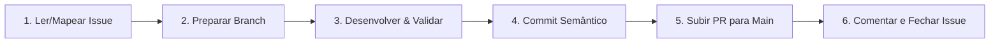

# Skill: Fluxo de Trabalho, Versionamento e Entrega — CVMC

Esta skill estabelece o fluxo de trabalho obrigatório de ponta a ponta para qualquer tarefa, issue ou modificação no projeto **CVMC (Como Vai Meu Carro)**.

---

## 🔄 Ciclo de Vida de uma Tarefa



---

## 📋 Protocolo de Execução Passo a Passo

### 1. Início da Tarefa & Preparação da Branch
- Analise a issue utilizando o GitHub MCP (`get_issue`).
- Garanta que está trabalhando em uma branch dedicada e semanticamente nomeada:
  - `feat/<nome-curto>`: Novas funcionalidades.
  - `fix/<nome-curto>`: Correções de bugs.
  - `docs/<nome-curto>`: Documentação, README, LICENSE.
  - `refactor/<nome-curto>`: Refatorações sem alteração de comportamento.
  - `chore/<nome-curto>`: Tarefas de build, dependências ou scripts.

### 2. Desenvolvimento & Validação Mandatória
- Execute as modificações necessárias seguindo as diretrizes da arquitetura (`cvmc-dev`) e segurança (`cvmc-security`).
- Se houver alteração em rotas ou handlers HTTP da API Go, execute `./scripts/swagger.sh`.
- Execute a checagem completa e assegure 100% de aprovação:
  ```bash
  ./scripts/check.sh all
  ```

### 3. Commits Semânticos (Conventional Commits)
- Organize os commits de forma atômica seguindo o padrão Conventional Commits:
  - Formato: `<tipo>(<escopo>): <descrição clara no imperativo>`
  - Exemplos:
    - `feat(auth): implement refresh token rotation with httponly cookies`
    - `fix(cars): handle empty results on car search filter`
    - `docs(readme): add project badges, production urls and license (#16)`
    - `chore(skills): add cvmc-workflow skill`

### 4. Criação do Pull Request para `main` (GitHub MCP)
- Faça o push da branch para o repositório remoto.
- Abra o Pull Request apontando para a base `main` utilizando a ferramenta MCP do GitHub (`create_pull_request`):
  - **Title**: `<tipo>(<escopo>): <título semântico claro>`
  - **Head**: `<nome-da-sua-branch>`
  - **Base**: `main`
  - **Body**: Deve conter:
    - Resumo das alterações realizadas.
    - Referência de fechamento da issue: `Closes #<número_da_issue>` ou `Resolves #<número_da_issue>`.
    - Checklist de validações executadas (`./scripts/check.sh all`, `./scripts/swagger.sh`).

### 5. Atualização e Fechamento da Issue (GitHub MCP)
- Adicione um comentário no GitHub Issue utilizando o MCP do GitHub (`add_issue_comment`):
  - Informe a conclusão da tarefa com resumo dos entregáveis.
  - Anexe o link e número do Pull Request criado.
- Atualize o status da issue para fechada utilizando `update_issue(state: "closed")` quando o trabalho for concluído.

---

## 🛠️ Matriz de Ferramentas GitHub MCP Utilizadas

| Etapa | Ferramenta MCP GitHub | Finalidade |
| :--- | :--- | :--- |
| **Leitura da Issue** | `get_issue` | Obter descrição, contexto e requisitos da tarefa |
| **Criação do PR** | `create_pull_request` | Abrir PR direcionado à branch `main` |
| **Comentário na Issue**| `add_issue_comment` | Registrar entrega com link do PR |
| **Fechamento da Issue**| `update_issue` | Atualizar estado para `closed` |
