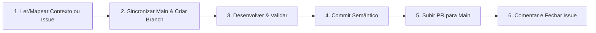

# Skill: Fluxo de Trabalho, Versionamento e Entrega — CVMC

Esta skill estabelece o fluxo de trabalho obrigatório de ponta a ponta para qualquer tarefa, issue ou modificação no projeto **CVMC (Como Vai Meu Carro)**.

---

## 🔄 Ciclo de Vida de uma Tarefa



---

## 📋 Protocolo de Execução Passo a Passo

### 1. Sincronização Obrigatória com a `main` Remota & Preparação da Branch
- Analise a issue utilizando o GitHub MCP (`get_issue`) ou o contexto da tarefa solicitada.
- **Sincronização Obrigatória com a `main`**:
  Antes de criar uma nova branch ou iniciar alterações, **sempre sincronize as referências com `origin/main`** para garantir que você está partindo do estado mais atualizado do código:
  ```bash
  # 1. Buscar as referências mais recentes do repositório remoto
  git fetch origin main

  # 2. Criar e alternar para a branch de trabalho baseada diretamente no origin/main atualizado
  git checkout -b <tipo>/<nome-da-branch> origin/main
  ```
  - Se preferir atualizar a branch local `main` antes de criar a branch de trabalho:
  ```bash
  git checkout main
  git pull --ff-only origin main
  git checkout -b <tipo>/<nome-da-branch>
  ```
  - Caso já esteja trabalhando em uma branch existente e novas alterações tenham entrado na `main`:
  ```bash
  git fetch origin main
  git rebase origin/main
  ```
- **Padrão de Nomenclatura das Branches**:
  - **Com Issue vinculada**: `<tipo>/<id_da_issue>-<descricao-curta>`
    - `feat/24-user-profile-and-auth-limits`: Validação de e-mail e limites vinculados à issue #24.
    - `feat/25-visual-identity-and-vehicle-images`: Upload de fotos e renders vinculados à issue #25.
    - `fix/28-remove-hardcoded-deploy-ip`: Correções de segurança em CI/CD vinculadas à issue #28.
    - `feat/42-edit-vehicle-and-year`: Edição de veículos e campos de ano vinculados à issue #42.
    - `fix/47-profile-infinite-loop`: Correção de loop de requisições vinculada à issue #47.
  - **Sem Issue vinculada (manutenções internas/skills/dependências)**: `<tipo>/<descricao-curta>`
    - `chore/skills-enhancement`: Ajustes de documentação interna e skills.
    - `docs/readme-update`: Atualizações de documentação.
    - `feat/dependency-updates`: Atualizações de bibliotecas e drivers.

### 2. Desenvolvimento & Validação Mandatória
- Execute as modificações necessárias seguindo as diretrizes da arquitetura (`cvmc-dev`) e segurança (`cvmc-security`).
- Se houver alteração em rotas ou handlers HTTP da API Go, execute obrigatoriamente:
  ```bash
  ./scripts/swagger.sh
  ```
- Execute a checagem completa e assegure 100% de aprovação antes de qualquer commit:
  ```bash
  ./scripts/check.sh all
  ```

### 3. Commits Semânticos (Conventional Commits)
- Organize os commits de forma atômica seguindo o padrão Conventional Commits:
  - **Com Issue**: `<tipo>(<escopo>): <descrição clara no imperativo> (#<id_da_issue>)`
    - `feat(user): validacao de e-mail, pagina de perfil e limites de veiculos (#24)`
    - `feat(design): identidade visual, upload de foto e renders svg por categoria (#25)`
    - `fix(ci): remover fallback hardcoded de IP no deploy (#28)`
    - `feat(cars): permitir edicao de veiculo e incluir campo de ano (#42)`
    - `fix(profile): desacoplar user do useEffect para prevenir loop infinito (#47)`
  - **Sem Issue**: `<tipo>(<escopo>): <descrição clara no imperativo>`
    - `chore(skills): sincronizar diretrizes de workflow com a main remota`
    - `feat(deps): bump frontend npm dependencies and backend mongodb driver`

### 4. Criação do Pull Request para `main` (GitHub MCP)
- Antes de submeter o PR, garanta que a branch está perfeitamente sincronizada com a última versão da `origin/main` (`git fetch origin main && git rebase origin/main`).
- Faça o push da branch para o repositório remoto:
  ```bash
  git push -u origin <nome-da-sua-branch>
  ```
- Abra o Pull Request apontando para a base `main` utilizando a ferramenta MCP do GitHub (`create_pull_request`):
  - **Title**: `<tipo>(<escopo>): <título semântico claro>` (com `(#<id_da_issue>)` se houver).
  - **Head**: `<nome-da-sua-branch>`
  - **Base**: `main`
  - **Body**: Deve conter:
    - Resumo detalhado das alterações realizadas.
    - Referência de fechamento se aplicável: `Closes #<id_da_issue>` ou `Resolves #<id_da_issue>`.
    - Checklist de validações executadas (`./scripts/check.sh all`, `./scripts/swagger.sh`).

### 5. Atualização e Fechamento da Issue (GitHub MCP)
- Se a tarefa estiver vinculada a uma issue:
  - Adicione um comentário na issue utilizando `add_issue_comment` informando a entrega com o link do PR criado.
  - Atualize o status da issue para fechada utilizando `update_issue(state: "closed")` quando o trabalho for entregue.

---

## 🛠️ Matriz de Ferramentas GitHub MCP Utilizadas

| Etapa | Ferramenta MCP GitHub | Finalidade |
| :--- | :--- | :--- |
| **Leitura da Issue** | `get_issue` | Obter descrição, contexto e requisitos da tarefa |
| **Criação do PR** | `create_pull_request` | Abrir PR direcionado à branch `main` |
| **Comentário na Issue**| `add_issue_comment` | Registrar entrega com link do PR |
| **Fechamento da Issue**| `update_issue` | Atualizar estado para `closed` |
