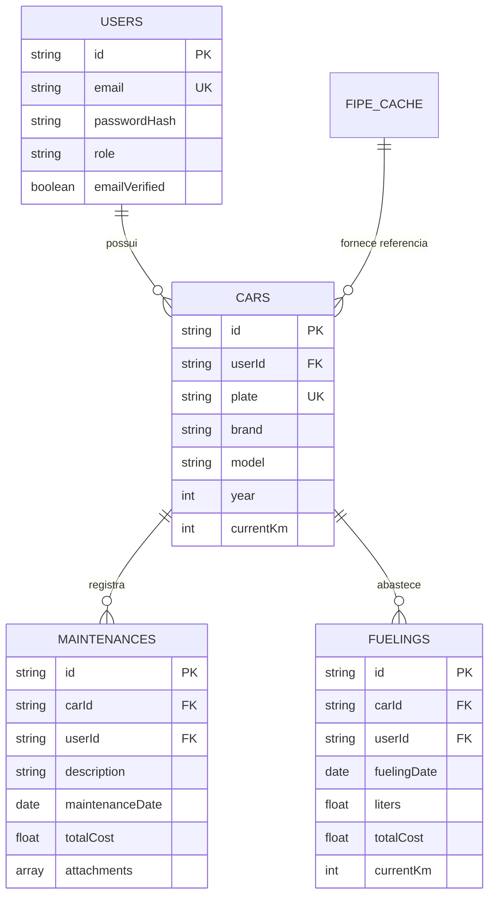

# 🗄️ Isolamento de Dados e Persistência — CVMC

O **CVMC (Como Vai Meu Carro)** utiliza o **MongoDB** como banco de dados NoSQL documental, aplicando segregação lógica por usuário em todas as consultas e operações mutáveis.

Para navegação geral, retorne ao [Catálogo Canônico](../index.md).

---

## 🧱 1. Segregação Lógica por Usuário

No CVMC, cada recurso (`Car`, `Maintenance`, `Fueling`) pertence estritamente ao condutor proprietário (`user_id`):

- **Validação Incondicional do Proprietário**:
  - Handlers e Use Cases sempre extraem o `userID` do token autenticado através das claims (`extractUserID`).
  - Todas as queries de busca, atualização ou exclusão incluem obrigatoriamente a cláusula `{"userId": userID}` no filtro MongoDB.
  - Tentativas de consultar ou modificar veículos ou manutenções de terceiros resultam imediatamente em `404 Not Found` ou `403 Forbidden`.

---

## 📑 2. Coleções do Sistema

---

## ⚡ 3. Estratégia de Indexação

Para garantir consultas instantâneas e prevenção de duplicações:

1. **`users`**:
   - `email` (único, esparso).
2. **`cars`**:
   - `{ userId: 1, plate: 1 }` (composto, único por usuário para evitar cadastro duplicado do mesmo veículo).
3. **`maintenances`**:
   - `{ userId: 1, carId: 1, maintenanceDate: -1 }` (otimizado para timeline de manutenções).
4. **`fuelings`**:
   - `{ userId: 1, carId: 1, fuelingDate: -1 }` (otimizado para relatórios de consumo médio e gráfico de abastecimentos).

---

## 🔗 Referências Cruzadas
- [Catálogo Canônico](../index.md)
- [Visão Geral da Arquitetura](overview.md)
- [Subdomínio de Veículos](../domain/car.md)
- [Subdomínio de Manutenções](../domain/maintenance.md)
- [Subdomínio de Abastecimentos](../domain/fuel.md)
