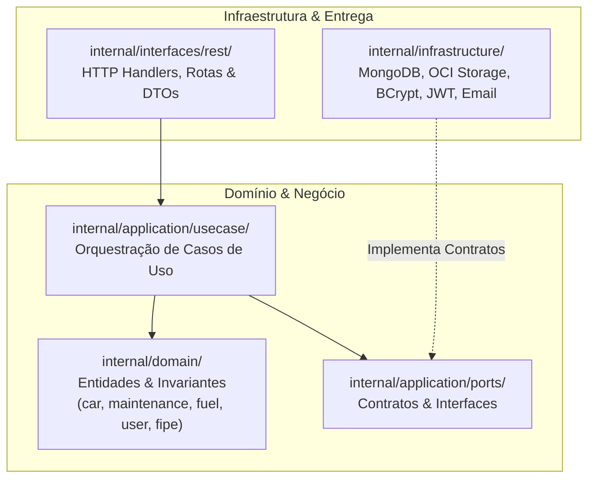

# 🏗️ Visão Geral da Arquitetura — CVMC (Como Vai Meu Carro)

O **CVMC (Como Vai Meu Carro)** é uma plataforma moderna para gestão de veículos, controle de abastecimentos, agendamento de manutenções e acompanhamento de depreciação via Tabela FIPE.

Para navegação geral, retorne ao [Catálogo Canônico](../index.md).

---

## 🏛️ Camadas Concêntricas (Clean Architecture + DDD)

O backend em Go adota separação estrita em camadas:

1. **`internal/domain/`**: Entidades e regras puras, sem dependências externas.
2. **`internal/application/ports/`**: Contratos de repositórios e serviços de terceiros.
3. **`internal/application/usecase/`**: Regras de aplicação e casos de uso independentes de UI ou persistência.
4. **`internal/interfaces/rest/`**: Entrega HTTP utilizando standard library `net/http` e handlers REST.
5. **`internal/infrastructure/`**: Drivers do MongoDB, integrações de storage local/OCI, cliente HTTP para FIPE, envio de e-mails via SMTP e implementações criptográficas (bcrypt/jwt).

---

## 🖥️ Frontend (SPA React 19 + MUI v6)

- Desenvolvido em **React 19**, **Vite** e **TypeScript**.
- Estilização construída com **Material UI v6** seguindo regras análogas de design (azul, ciano e esmeralda).
- Estado global gerenciado com **Zustand** para autenticação e perfil.
- Roteamento declarativo com **React Router v7** e controle de permissões via componente `ProtectedRoute`.

---

## 🔗 Referências Cruzadas
- [Catálogo Canônico](../index.md)
- [Autenticação e Segurança em Camadas](auth-and-security.md)
- [Isolamento de Dados e Persistência](multitenancy-and-data.md)
- [Armazenamento e Gestão de Mídia](storage-and-media.md)
- [ADR 0001: Adoção de Clean Architecture e DDD](../adrs/0001-clean-architecture-go.md)
