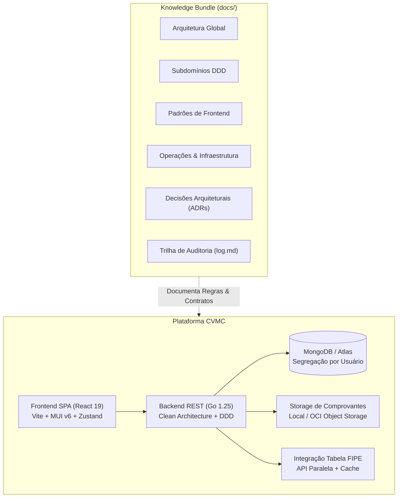

# 📚 Catálogo Canônico & LLM Wiki — CVMC (Como Vai Meu Carro)

Bem-vindo à base de conhecimento canônica do **CVMC (Como Vai Meu Carro)**. Este repositório de conhecimento é estruturado sob o padrão **Open Knowledge Format (OKF)** do Google Cloud, servindo como a **Fonte Canônica da Verdade** tanto para desenvolvedores quanto para agentes autônomos de IA.

---

## 🧭 Princípio da Divulgação Progressiva (*Progressive Disclosure*)

Para garantir máxima eficiência no consumo de tokens e prevenir alucinações de modelos de IA, a base de conhecimento adota uma estrutura em árvore:

1. **Nível 1 (Este Catálogo)**: Fornece o panorama geral do ecossistema, taxonomia e sitemap do projeto.
2. **Nível 2 (Índices Temáticos)**: Documentos de visão geral de arquitetura, subdomínios, frontend e operações.
3. **Nível 3 (Especificações Especializadas)**: Especificações aprofundadas com regras de negócio, interfaces e contratos de código.
4. **Nível 4 (ADRs e Runbooks)**: Registros imutáveis de decisão e guias de resolução operacional de incidentes.

> [!TIP]
> **Para Agentes de IA**: Consulte primeiro este catálogo para localizar o arquivo específico necessário à sua tarefa. Leia apenas o documento relevante utilizando `view_file` para manter o contexto enxuto e preciso.

---

## 🗺️ Mapa Conceitual do Ecossistema CVMC

---

## 🗂️ Índice Estruturado da Base de Conhecimento

### 1. 🏗️ Arquitetura Global (`architecture/`)
Decisões de engenharia em alto nível, isolamento de camadas e requisitos não-funcionais:
- [Visão Geral da Arquitetura](architecture/overview.md): Clean Architecture e DDD em Go, desacoplamento em camadas e modelo SPA.
- [Autenticação e Segurança em Camadas](architecture/auth-and-security.md): Cookies `HttpOnly`, tokens JWT, rate limiting e mitigação OWASP.
- [Isolamento de Dados e Persistência](architecture/multitenancy-and-data.md): Segregação lógica por usuário (`user_id`), coleções e índices compostos no MongoDB.
- [Armazenamento e Gestão de Mídia](architecture/storage-and-media.md): Abstração de storage, sanitização contra Path Traversal, defesa contra XSS armazenado e OCI Object Storage.

### 2. 🏛️ Subdomínios de Negócio DDD (`domain/`)
Especificações detalhadas de regras de negócio, agregações e fluxos de cada subdomínio:
- [Car (Veículos & Frota)](domain/car.md): Cadastro de veículos, placa, quilometragem, ano, modelo e histórico do automóvel.
- [Maintenance (Manutenções)](domain/maintenance.md): Ordens de serviço, manutenções preventivas/corretivas, oficinas, custos e anexos.
- [Fuel (Abastecimentos)](domain/fuel.md): Histórico de abastecimentos, postos, preços por litro e cálculo de consumo médio (km/l).
- [Fipe (Consulta Tabela FIPE)](domain/fipe.md): Integração com API FIPE, busca de marcas, modelos, anos e valor de mercado com cache.
- [User (Identidade & Usuários)](domain/user.md): Cadastro de condutores, credenciais seguras, papéis de acesso e recuperação de senha.
- [Attachment (Anexos & Comprovantes)](domain/attachment.md): Sanitização de arquivos, tipos permitidos, controle de tamanho e segurança de downloads.

### 3. 🖥️ Engenharia de Frontend (`frontend/`)
Padrões de desenvolvimento para a SPA React 19:
- [Gerenciamento de Estado com Zustand](frontend/state-management.md): Stores centralizadas, sincronização de perfil e proteção de autenticação.
- [Roteamento e Controle de Acesso (RBAC)](frontend/routing-and-rbac.md): React Router v7, proteção declarativa com `ProtectedRoute` e menus da aplicação.
- [Componentes UI e Design System](frontend/ui-components.md): Material UI v6, paleta análoga azul/cyan/esmeralda, acessibilidade (WCAG AA), regras de padding e headings.

### 4. ⚙️ Operações, Infraestrutura & Runbooks (`operations/`)
Manuais operacionais, infraestrutura como código e automação de entrega contínua:
- [Ambiente e Configuração](operations/environment-and-config.md): Gerenciamento de variáveis de ambiente, `.env.example` e segredos.
- [Docker e Ambiente de Desenvolvimento Local](operations/docker-and-local-dev.md): Stack Docker Compose e comandos rápidos via scripts.
- [Deploy e Topologia de Nuvem](operations/deploy-and-infrastructure.md): Oracle Cloud Infrastructure (OCI Compute), Caddy com SSL automático e Cloudflare.
- [Pipelines de CI/CD](operations/ci-cd-pipelines.md): GitHub Actions, esteiras de testes automatizados, linters e governança de releases.
- **Runbooks de Resolução de Incidentes**:
  - [Runbook: Recuperação de Desastres (Disaster Recovery)](operations/runbooks/disaster-recovery.md): Restabelecimento de nó OCI e failover de DNS.
  - [Runbook: Backup e Restauração de Banco de Dados](operations/runbooks/database-backup.md): Procedimentos de dump/restore no MongoDB Atlas e local.
  - [Runbook: Release e Rollback em Produção](operations/runbooks/release-and-rollback.md): Procedimentos de implantação contínua e reversão imediata.

### 5. 📜 Registros de Decisões de Arquitetura (`adrs/`)
Histórico imutável de decisões de engenharia:
- [ADR 0001: Adoção de Clean Architecture e DDD em Go](adrs/0001-clean-architecture-go.md)
- [ADR 0002: Autenticação via Cookies HttpOnly e Sessões Stateless](adrs/0002-httponly-cookie-sessions.md)
- [ADR 0003: Gerenciamento de Estado Global com Zustand](adrs/0003-zustand-state-management.md)
- [ADR 0004: Governança Canônica de Documentação OKF e Zero-Divergence](adrs/0004-canonical-docs-okf.md)

### 6. 🕒 Trilha de Auditoria e Histórico Datado
- [Diário de Bordo & Registro Cronológico](log.md): Linha do tempo das mudanças realizadas no repositório.
